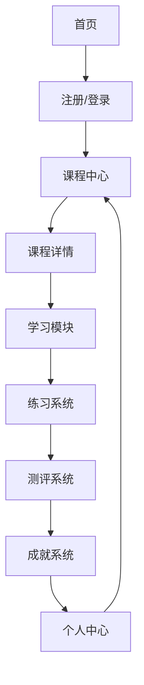

# 数据分析在线教育平台 - 产品需求文档

## 产品概述
- **摘要**：基于Python的数据分析在线教育平台，为商务数据分析与应用专业的学生提供完整的课程体系和互动式学习体验。
- **目的**：解决商务数据分析专业学生的实践学习需求，提供系统化的Python数据分析课程和互动式学习环境。
- **目标用户**：商务数据分析与应用专业的学生，以及对数据分析感兴趣的学习者。

## 核心功能

### 2.1 用户角色
| 角色 | 注册方式 | 核心权限 |
|------|----------|----------|
| 学生 | 邮箱注册 | 浏览课程、学习内容、完成练习、参加测评、查看成就 |
| 管理员 | 邀请码注册 | 管理课程内容、用户、测评结果、成就系统 |

### 2.2 功能模块
1. **首页**：平台介绍、课程分类、最新动态、用户登录/注册
2. **课程中心**：完整的课程体系、课程详情、学习进度跟踪
3. **学习模块**：视频教程、代码示例、互动练习、实时反馈
4. **练习系统**：编程练习、数据处理任务、案例分析
5. **测评系统**：章节测试、综合测评、成绩分析
6. **成就系统**：学习徽章、等级提升、学习报告
7. **个人中心**：学习记录、成就展示、个人设置

### 2.3 页面详情
| 页面名称 | 模块名称 | 功能描述 |
|---------|---------|----------|
| 首页 | 平台介绍 | 展示平台特色、核心功能、目标用户群体 |
| 首页 | 课程分类 | 按难度、主题分类展示课程，支持筛选和搜索 |
| 首页 | 最新动态 | 展示平台更新、活动和推荐内容 |
| 首页 | 登录/注册 | 用户账号管理入口 |
| 课程中心 | 课程列表 | 展示所有课程，支持排序和筛选 |
| 课程中心 | 课程详情 | 课程介绍、大纲、讲师信息、学习进度 |
| 学习模块 | 视频教程 | 高清视频播放、字幕、进度记忆 |
| 学习模块 | 代码示例 | 可运行的Python代码示例，支持在线编辑和执行 |
| 学习模块 | 互动练习 | 实时反馈的编程练习，包含提示和解答 |
| 练习系统 | 编程练习 | 基于真实场景的Python编程任务 |
| 练习系统 | 数据处理任务 | 基于真实数据集的分析任务 |
| 练习系统 | 案例分析 | 商业数据分析案例，引导学生进行分析 |
| 测评系统 | 章节测试 | 针对课程章节的知识点测试 |
| 测评系统 | 综合测评 | 全面的数据分析能力评估 |
| 测评系统 | 成绩分析 | 个人成绩趋势、知识点掌握情况分析 |
| 成就系统 | 学习徽章 | 根据学习行为和成就发放的数字徽章 |
| 成就系统 | 等级提升 | 基于学习进度和表现的等级系统 |
| 成就系统 | 学习报告 | 个人学习情况的详细报告 |
| 个人中心 | 学习记录 | 所有课程的学习进度和完成情况 |
| 个人中心 | 成就展示 | 已获得的徽章和等级展示 |
| 个人中心 | 个人设置 | 账号信息、偏好设置、通知管理 |

## 3. 核心流程
用户注册/登录 → 浏览课程 → 选择课程 → 开始学习 → 完成练习 → 参加测评 → 获取成就 → 查看学习报告

## 4. 用户界面设计
### 4.1 设计风格
- 主色调：蓝色系 (#1E40AF, #3B82F6)，代表专业和信任
- 辅助色：橙色 (#F97316)，用于强调和交互元素
- 按钮风格：圆角矩形，有轻微的阴影效果
- 字体：系统默认无衬线字体，标题使用稍大字号
- 布局风格：卡片式布局，清晰的层次结构
- 图标风格：简约现代的线性图标

### 4.2 页面设计概览
| 页面名称 | 模块名称 | UI元素 |
|---------|---------|--------|
| 首页 | 平台介绍 | 大型横幅图片，简洁的标题和副标题，突出平台特色的图标 |
| 首页 | 课程分类 | 网格布局的课程卡片，包含课程名称、难度、时长等信息 |
| 学习模块 | 视频教程 | 响应式视频播放器，侧边导航栏，进度指示器 |
| 学习模块 | 代码示例 | 代码编辑器界面，语法高亮，运行按钮，输出窗口 |
| 练习系统 | 编程练习 | 任务描述区域，代码编辑器，测试用例展示，提交按钮 |
| 测评系统 | 章节测试 | 题目列表，答题区域，进度条，提交按钮 |
| 成就系统 | 学习徽章 | 网格布局的徽章展示，动画效果，获取时间 |
| 个人中心 | 学习记录 | 时间线形式的学习记录，进度条，状态指示器 |

### 4.3 响应式设计
- 桌面优先设计，同时支持平板和移动设备
- 在小屏幕上优化布局，确保内容可读性
- 触摸友好的界面元素，适合移动设备操作

### 4.4 交互设计
- 平滑的过渡动画，提升用户体验
- 实时反馈机制，如练习提交后的即时评分
- 进度保存功能，确保学习连续性
- 个性化推荐系统，基于用户的学习历史和兴趣