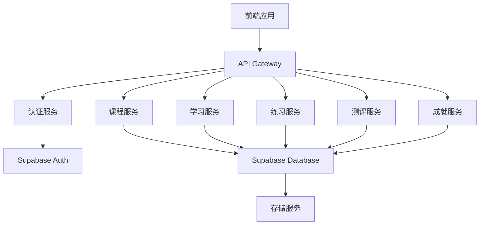
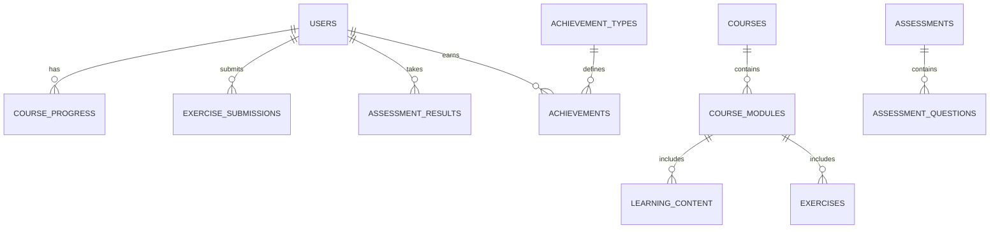

# 数据分析在线教育平台 - 技术架构文档

## 1. 架构设计



## 2. 技术描述
- **前端**：React@18 + TypeScript + Tailwind CSS + Vite
- **初始化工具**：vite-init
- **后端**：Supabase (认证、数据库、存储)
- **数据库**：Supabase (PostgreSQL)
- **部署**：Cloudflare Pages

## 3. 路由定义

| 路由 | 目的 |
|------|------|
| / | 首页 |
| /login | 登录页面 |
| /register | 注册页面 |
| /courses | 课程中心 |
| /courses/:id | 课程详情 |
| /learn/:courseId/:moduleId | 学习模块 |
| /practice | 练习系统 |
| /practice/:id | 练习详情 |
| /assessment | 测评系统 |
| /assessment/:id | 测评详情 |
| /achievements | 成就系统 |
| /profile | 个人中心 |
| /admin | 管理员后台 |

## 4. API 定义

### 4.1 认证 API
- **注册**：POST /api/auth/register
  - 请求体：{ email, password, name }
  - 响应：{ user, token }

- **登录**：POST /api/auth/login
  - 请求体：{ email, password }
  - 响应：{ user, token }

- **登出**：POST /api/auth/logout
  - 响应：{ success: true }

### 4.2 课程 API
- **获取课程列表**：GET /api/courses
  - 响应：[{ id, title, description, difficulty, duration, image }]

- **获取课程详情**：GET /api/courses/:id
  - 响应：{ id, title, description, difficulty, duration, image, modules }

- **获取学习进度**：GET /api/courses/:id/progress
  - 响应：{ progress, completedModules }

### 4.3 学习 API
- **获取学习内容**：GET /api/learn/:courseId/:moduleId
  - 响应：{ content, videos, codeExamples, exercises }

- **保存学习进度**：POST /api/learn/progress
  - 请求体：{ courseId, moduleId, progress }
  - 响应：{ success: true }

### 4.4 练习 API
- **获取练习列表**：GET /api/practice
  - 响应：[{ id, title, difficulty, description }]

- **获取练习详情**：GET /api/practice/:id
  - 响应：{ id, title, description, tasks, testCases }

- **提交练习**：POST /api/practice/:id/submit
  - 请求体：{ code, answers }
  - 响应：{ score, feedback, passed }

### 4.5 测评 API
- **获取测评列表**：GET /api/assessment
  - 响应：[{ id, title, type, duration, description }]

- **获取测评详情**：GET /api/assessment/:id
  - 响应：{ id, title, questions, duration }

- **提交测评**：POST /api/assessment/:id/submit
  - 请求体：{ answers }
  - 响应：{ score, results, passed }

- **获取测评历史**：GET /api/assessment/history
  - 响应：[{ id, assessmentId, score, date }]

### 4.6 成就 API
- **获取成就列表**：GET /api/achievements
  - 响应：[{ id, name, description, icon, unlockedAt }]

- **获取等级信息**：GET /api/achievements/level
  - 响应：{ currentLevel, progress, nextLevel }

- **获取学习报告**：GET /api/achievements/report
  - 响应：{ totalCourses, completedCourses, totalHours, achievements, strengths, weaknesses }

## 5. 数据模型

### 5.1 数据模型定义



### 5.2 数据定义语言

#### 用户表
```sql
CREATE TABLE users (
  id UUID PRIMARY KEY DEFAULT gen_random_uuid(),
  email TEXT UNIQUE NOT NULL,
  password_hash TEXT NOT NULL,
  name TEXT NOT NULL,
  role TEXT DEFAULT 'student',
  created_at TIMESTAMP DEFAULT NOW(),
  updated_at TIMESTAMP DEFAULT NOW()
);
```

#### 课程表
```sql
CREATE TABLE courses (
  id UUID PRIMARY KEY DEFAULT gen_random_uuid(),
  title TEXT NOT NULL,
  description TEXT NOT NULL,
  difficulty TEXT NOT NULL,
  duration INTEGER NOT NULL, -- 课程时长（小时）
  image TEXT,
  created_at TIMESTAMP DEFAULT NOW(),
  updated_at TIMESTAMP DEFAULT NOW()
);
```

#### 课程模块表
```sql
CREATE TABLE course_modules (
  id UUID PRIMARY KEY DEFAULT gen_random_uuid(),
  course_id UUID REFERENCES courses(id),
  title TEXT NOT NULL,
  description TEXT NOT NULL,
  order_index INTEGER NOT NULL,
  created_at TIMESTAMP DEFAULT NOW(),
  updated_at TIMESTAMP DEFAULT NOW()
);
```

#### 学习内容表
```sql
CREATE TABLE learning_content (
  id UUID PRIMARY KEY DEFAULT gen_random_uuid(),
  module_id UUID REFERENCES course_modules(id),
  type TEXT NOT NULL, -- video, code, text
  content TEXT NOT NULL,
  order_index INTEGER NOT NULL,
  created_at TIMESTAMP DEFAULT NOW(),
  updated_at TIMESTAMP DEFAULT NOW()
);
```

#### 练习表
```sql
CREATE TABLE exercises (
  id UUID PRIMARY KEY DEFAULT gen_random_uuid(),
  module_id UUID REFERENCES course_modules(id),
  title TEXT NOT NULL,
  description TEXT NOT NULL,
  difficulty TEXT NOT NULL,
  tasks TEXT NOT NULL, -- JSON 格式的任务描述
  test_cases TEXT NOT NULL, -- JSON 格式的测试用例
  created_at TIMESTAMP DEFAULT NOW(),
  updated_at TIMESTAMP DEFAULT NOW()
);
```

#### 课程进度表
```sql
CREATE TABLE course_progress (
  id UUID PRIMARY KEY DEFAULT gen_random_uuid(),
  user_id UUID REFERENCES users(id),
  course_id UUID REFERENCES courses(id),
  module_id UUID REFERENCES course_modules(id),
  progress INTEGER DEFAULT 0, -- 0-100
  completed BOOLEAN DEFAULT FALSE,
  last_accessed TIMESTAMP DEFAULT NOW(),
  created_at TIMESTAMP DEFAULT NOW(),
  updated_at TIMESTAMP DEFAULT NOW()
);
```

#### 练习提交表
```sql
CREATE TABLE exercise_submissions (
  id UUID PRIMARY KEY DEFAULT gen_random_uuid(),
  user_id UUID REFERENCES users(id),
  exercise_id UUID REFERENCES exercises(id),
  code TEXT,
  answers TEXT, -- JSON 格式的答案
  score INTEGER,
  passed BOOLEAN,
  feedback TEXT,
  submitted_at TIMESTAMP DEFAULT NOW()
);
```

#### 测评表
```sql
CREATE TABLE assessments (
  id UUID PRIMARY KEY DEFAULT gen_random_uuid(),
  title TEXT NOT NULL,
  type TEXT NOT NULL, -- quiz, exam
  duration INTEGER NOT NULL, -- 测评时长（分钟）
  description TEXT,
  created_at TIMESTAMP DEFAULT NOW(),
  updated_at TIMESTAMP DEFAULT NOW()
);
```

#### 测评问题表
```sql
CREATE TABLE assessment_questions (
  id UUID PRIMARY KEY DEFAULT gen_random_uuid(),
  assessment_id UUID REFERENCES assessments(id),
  question TEXT NOT NULL,
  options TEXT, -- JSON 格式的选项
  correct_answer TEXT NOT NULL,
  points INTEGER DEFAULT 1,
  order_index INTEGER NOT NULL,
  created_at TIMESTAMP DEFAULT NOW(),
  updated_at TIMESTAMP DEFAULT NOW()
);
```

#### 测评结果表
```sql
CREATE TABLE assessment_results (
  id UUID PRIMARY KEY DEFAULT gen_random_uuid(),
  user_id UUID REFERENCES users(id),
  assessment_id UUID REFERENCES assessments(id),
  score INTEGER,
  total_points INTEGER,
  passed BOOLEAN,
  answers TEXT, -- JSON 格式的答案
  completed_at TIMESTAMP DEFAULT NOW()
);
```

#### 成就类型表
```sql
CREATE TABLE achievement_types (
  id UUID PRIMARY KEY DEFAULT gen_random_uuid(),
  name TEXT NOT NULL,
  description TEXT NOT NULL,
  icon TEXT NOT NULL,
  condition TEXT NOT NULL, -- JSON 格式的达成条件
  created_at TIMESTAMP DEFAULT NOW(),
  updated_at TIMESTAMP DEFAULT NOW()
);
```

#### 成就表
```sql
CREATE TABLE achievements (
  id UUID PRIMARY KEY DEFAULT gen_random_uuid(),
  user_id UUID REFERENCES users(id),
  achievement_type_id UUID REFERENCES achievement_types(id),
  unlocked_at TIMESTAMP DEFAULT NOW()
);
```

## 6. 部署策略

### 6.1 Cloudflare Pages 配置
- **构建命令**：`npm run build`
- **构建输出目录**：`dist`
- **环境变量**：
  - `VITE_SUPABASE_URL`：Supabase 项目 URL
  - `VITE_SUPABASE_ANON_KEY`：Supabase 匿名访问密钥

### 6.2 性能优化
- **前端**：使用 Vite 进行构建优化，实现代码分割和懒加载
- **静态资源**：使用 Cloudflare 的 CDN 进行静态资源缓存
- **API 调用**：实现客户端缓存，减少重复请求

### 6.3 安全措施
- **认证**：使用 Supabase Auth 进行用户认证
- **数据安全**：实现行级安全策略，确保用户只能访问自己的数据
- **CORS**：配置适当的 CORS 策略，防止跨站请求伪造

## 7. 开发环境设置

### 7.1 前端环境
- **Node.js**：v18+
- **包管理器**：pnpm 或 npm
- **开发命令**：`npm run dev`
- **构建命令**：`npm run build`
- **预览命令**：`npm run preview`

### 7.2 后端环境
- **Supabase 项目**：创建 Supabase 项目并配置数据库表结构
- **本地开发**：使用 Supabase CLI 进行本地开发和测试

## 8. 扩展性考虑

### 8.1 未来功能扩展
- **社区功能**：添加讨论区、学习小组等社区功能
- **内容管理系统**：实现更完善的课程内容管理功能
- **数据分析工具**：集成更多数据分析工具和库
- **企业培训**：添加企业培训功能和管理后台

### 8.2 技术扩展性
- **微服务架构**：当前使用 Supabase 作为后端，未来可以考虑拆分为微服务架构
- **缓存策略**：实现更复杂的缓存策略，提高系统性能
- **监控系统**：添加系统监控和日志分析功能